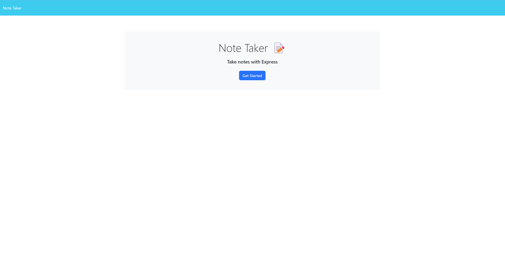

# CWRU Bootcamp Challenge 11 - Note Registry

    
## Description
    
### The goal of this project was to create a notes registry, that can save notes to a JSON database file called db.json and recall them, displaying them on a html page hosted on a localhost server.
### Behind the scenes, this program heavily relies on Express JS for server hosting/pathing using routers, GET, POST and even DELETE requests!
### In addition, we used ideas, such as DOM traversal and the original index.js predominantly showcased in the Front-End portion of this bootcamp, integrating them and adding in a Back-End!

## Table of Contents

- [Installation](#installation)
- [Usage](#usage)
- [Video](#video)
- [Contrubuting](#contributing)
- [License](#license)
- [Contact Me](#questions)

## Installation

Simply download the files, run 'npm install' to get the required packages! 

## Usage

After doing the procedure done during installation, just run 'node server' in the command line within the 'public' folder and follow the prompts given to create your own personal note registry!

## Video

### Here is a link to the video example showcasing the installation and usage of this project:

## Example outputs from program

<figure>
    
    <figcaption>Homepage</figcaption></figure>
<figure>
    
    <figcaption>Empty Note Registry</figcaption>
</figure>
<figure>
    
    <figcaption>Full Note Registry</figcaption>
</figure>
<figure>
    
    <figcaption>When typing a new note, a save button appears to add it to the list!</figcaption>
</figure>

## Contributing

Feel free to fork this repo if you have anything you want to add, change, or remove in regards to this project. I love feedback!

## License

The license used in this project was the MIT license! Please reference the LICENSE file inside of the repository.

## Questions?

You can find me here on GitHub at https://www.github.com/Anthony-GG

Otherwise, feel free to reach me at anthony@vayneglory.com

---